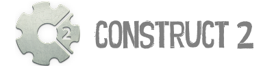
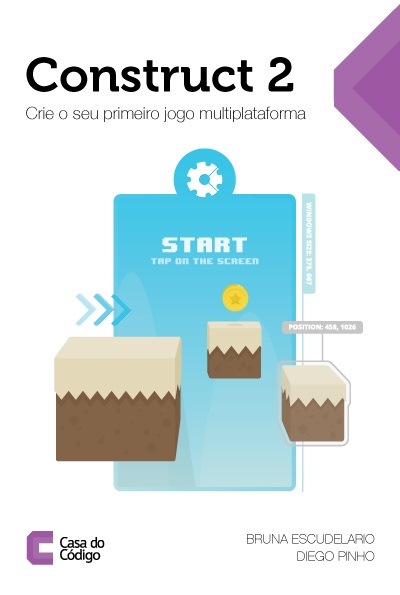

Construct 2 - Crie sue primeiro jogo multiplataforma
======================
Repositório oficial do livro: Construct 2 - Crie sue primeiro jogo multiplataforma

O mercado de jogos no Brasil e o número de pessoas interessadas em ingressar nele não param de crescer. Porém, a maioria das plataformas para produção de jogos exige tanto background tecnológico que acaba desanimando qualquer um. Felizmente, o Construct 2 surgiu pensando no usuário que deseja desenvolver suas próprias ideias, sem a necessidade de possuir algum conhecimento técnico prévio.

Neste livro, nós te provaremos que qualquer um é capaz de construir seus próprios jogos e exportá-los nos mais diversos formatos. Você verá como funcionam todos os mecanismos para criar um jogo de plataforma completo, com todas as telas, sistema de inimigos e movimentação dos personagens, que funcionará tanto em navegadores como em celulares! 

Como utilizar este repositório
------
Este repositório está contém todos os recursos que serão utilizados no decorrer da leitura do livro. Toda a estrutura de pastas corresponde ao que será solicitado no livro. Seu uso não é obrigatório, mas **fortemente** recomendado.

Este repositório também contém o projeto final que será construído durante o livro. Além disso, este pacote contém algumas fases e recursos que vão além que os mostrados nos exemplos, então fique a vontade para espiar.

Bons jogos!

Obrigado!

Detalhes do livro
------
**Número de páginas:** 227 

**ISBN:** 978-85-94188-39-7 

------
Tendo algum dúvida, crítica, sugestão ou até mesmo encontrar um erro, não hesite em entrar em contato! Também fique a vontade para fazer um fork neste projeto e fazer sugestões de melhorias.

**Construct 2 - Crie o seu primeiro jogo multiplataforma** © 2017+, Bruna de Freitas Escudelario. Diego Martins de Pinho. Publicado pela editora [Casa do Código](https://www.casadocodigo.com.br/). Todos os direitos reservados.